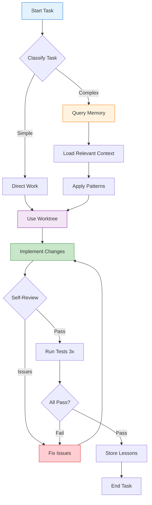
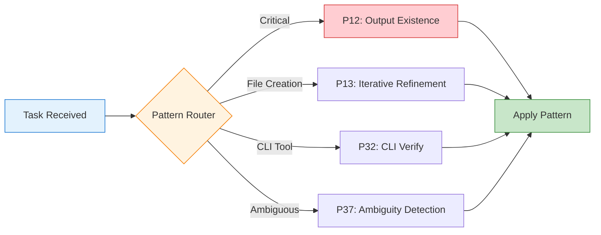

# AGENT.md - Development Guide

UAP development guidelines.

---

## Quick Reference

```bash
# Testing
npm test              # Run all tests (693 tests)
npm run test:coverage # Coverage report

# Linting & Type Checking
npm run lint          # ESLint
npm run format        # Prettier
npm run build         # TypeScript compilation

# UAP Commands
uap init              # Initialize UAP in project
uap setup -p all      # Full setup
uap dashboard         # Open dashboard
```

---

## Decision Loop



**Steps:**

1. **READ** short-term memory (recent context)
2. **QUERY** long-term memory (semantic search for relevant learnings)
3. **THINK** about what to do next
4. **ACT** - execute your decision
5. **RECORD** - write to short-term memory
6. **OPTIONALLY** - if significant learning, add to long-term memory

---

## Browser Usage

When using browser automation:

- **ALWAYS** save a screenshot after every browser action
- Save screenshots to: `agents/data/screenshots/`
- Filename format: `{timestamp}_{action}.png`

```typescript
import { createWebBrowser } from '@miller-tech/uap/browser';

const browser = createWebBrowser();
await browser.launch({ headless: true, humanize: true });

// Take screenshot after each action
await browser.screenshot('agents/data/screenshots/1704067200000_navigation.png');

await browser.close();
```

---

## Completion Checklist

Before marking any task as complete:

```markdown
- [ ] Tests updated and passing (minimum 3 runs)
- [ ] Linting/type checking passed (`npm run lint && npm run build`)
- [ ] Documentation updated (if applicable)
- [ ] No secrets in code/commits
- [ ] Memory lessons stored (if significant learning)
- [ ] Worktree cleaned up (if PR merged)
```

---

## Code Quality Standards

### TypeScript Conventions

```typescript
// ✅ Good
export interface UserConfig {
  name: string;
  enabled: boolean;
}

export function createUser(config: UserConfig): User {
  return { ...config, createdAt: Date.now() };
}

// ❌ Avoid
export const userConfig = {};
function create(x) { return x; }
```

### Error Handling

```typescript
// ✅ Good - Use typed errors
try {
  await riskyOperation();
} catch (error) {
  if (error instanceof ValidationError) {
    logger.warn('Validation failed', { error });
    throw new PolicyViolationError('Invalid operation');
  }
  throw error;
}

// ❌ Avoid - Generic catch
try {
  await riskyOperation();
} catch (e) {
  console.log(e);
}
```

### Logging

```typescript
import { logger } from '@miller-tech/uap/utils/logger';

// ✅ Good - Structured logging
logger.info('Memory query executed', {
  query: 'authentication errors',
  results: 5,
  durationMs: 23,
});

// ❌ Avoid - Console.log
console.log('Query result:', results);
```

---

## Memory System Guidelines

### When to Store Memories

**Store when:**
- Important decision with rationale (importance ≥ 7)
- Pattern discovered that prevents future errors
- Configuration choice with context
- Performance optimization with benchmarks

**Don't store:**
- Trivial observations
- Temporary debugging info
- Sensitive data (secrets, tokens, keys)
- Redundant information

### Memory Storage Pattern

```typescript
import { getHierarchicalMemoryManager } from '@miller-tech/uap/memory/hierarchical-memory';

const memory = await getHierarchicalMemoryManager();

// Store important lesson
await memory.store({
  type: 'lesson',
  content: 'Always validate CSRF tokens in auth flows',
  importance: 8,
  tags: ['security', 'authentication'],
});

// Query relevant memories
const results = await memory.query('authentication security', {
  topK: 5,
  scoreThreshold: 0.35,
});
```

---

## Worktree Workflow

### Creating a Worktree

```bash
# Create worktree for any change (even single file)
uap worktree create feature-description

# Navigate to worktree
cd .worktrees/NNN-feature-description/

# Make changes and commit
git add -A && git commit -m "feat: implement feature"
```

### Important Rules

1. **Never** edit files in the project root directly
2. **Always** use worktrees for file modifications
3. **Always** cleanup worktree after PR merge
4. **Always** verify you're inside a worktree before editing:
   ```bash
   uap worktree ensure --strict
   ```

---

## Testing Guidelines

### Unit Tests

```typescript
import { describe, it, expect } from 'vitest';
import { createUser } from './user';

describe('createUser', () => {
  it('creates user with default values', () => {
    const user = createUser({ name: 'John' });
    expect(user.enabled).toBe(true);
    expect(user.createdAt).toBeDefined();
  });

  it('creates user with custom values', () => {
    const user = createUser({ name: 'Jane', enabled: false });
    expect(user.name).toBe('Jane');
    expect(user.enabled).toBe(false);
  });
});
```

### Test Requirements

- **Minimum 2 test cases** per feature
- **Coverage threshold**: 50%
- **Run tests minimum 3 times** before declaring done
- **Include edge cases** in test suite

---

## Pattern System

Patterns stored in `.factory/patterns/` and automatically loaded.



**Critical Patterns (Always Active):**

- **P12 Output Existence**: Verify all output files exist
- **P35 Decoder-First**: Correct problem decomposition

---

## Multi-Model Architecture

### Model Selection

```typescript
import { createRouter, TaskComplexity } from '@miller-tech/uap/models';

const router = await createRouter({
  strategy: 'balanced', // or 'cost-optimized', 'performance'
  profiles: ['opus-4.6', 'qwen35'],
});

// Route task to optimal model
const result = await router.routeTask({
  complexity: TaskComplexity.MEDIUM,
  domain: 'coding',
  hasCode: true,
});

console.log(`Using model: ${result.modelId}`);
```

### Model Profiles

Pre-configured profiles in `config/model-profiles/`:
- **opus-4.6**: Complex reasoning, planning
- **qwen35**: Code generation, fast iteration
- **generic**: Fallback for unknown tasks

---

## Policy Enforcement

### Policy Levels

| Level | Behavior |
|-------|----------|
| REQUIRED | Blocks execution, throws `PolicyViolationError` |
| RECOMMENDED | Logged but does not block |
| OPTIONAL | Informational only |

### Creating a Policy

```markdown
<!-- POLICY: security-audit -->
# Security Audit Required

**Level**: REQUIRED
**Stage**: pre-commit

When modifying authentication-related files, ensure:
1. Input validation is implemented
2. CSRF tokens are validated
3. Rate limiting is configured
```

---

## Debugging

### Common Issues

| Error | Solution |
|-------|----------|
| `ModuleNotFoundError` | Run `npm install` after cloning |
| `Qdrant connection failed` | Start Docker: `cd agents && docker-compose up -d` |
| `Worktree already exists` | Use `uap worktree cleanup <id>` first |
| `Memory DB locked` | Close other processes using the DB |
| `Compliance check failed` | Review specific gate failure in output |

### Debug Mode

```bash
# Enable verbose logging
export UAP_VERBOSE=true

# Check memory queries
uap task ready --verbose

# Inspect database directly
sqlite3 ./agents/data/memory/short_term.db ".tables"
```

---

## Contributing

### Development Setup

```bash
# Clone repository
git clone https://github.com/DammianMiller/universal-agent-protocol.git
cd universal-agent-protocol

# Install dependencies
npm install

# Build project
npm run build

# Run tests
npm test
```

### Commit Messages

Use conventional commits:

```
type(scope): description

[optional body]

[optional footer]
```

**Types**: feat, fix, docs, style, refactor, test, chore

**Examples**:
```
feat(memory): add semantic compression for token efficiency
fix(coord): resolve race condition in agent heartbeat
docs(README): update quick start instructions with new commands
```

---

## Resources

- **[Documentation](docs/INDEX.md)**: Full documentation
- **[CLI Reference](docs/reference/UAP_CLI_REFERENCE.md)**: Command reference
- **[Architecture](docs/architecture/SYSTEM_ANALYSIS.md)**: System architecture
- **[GitHub Issues](https://github.com/DammianMiller/universal-agent-protocol/issues)**: Report bugs

---

**Maintained by**: UAP Team  
**License**: MIT
