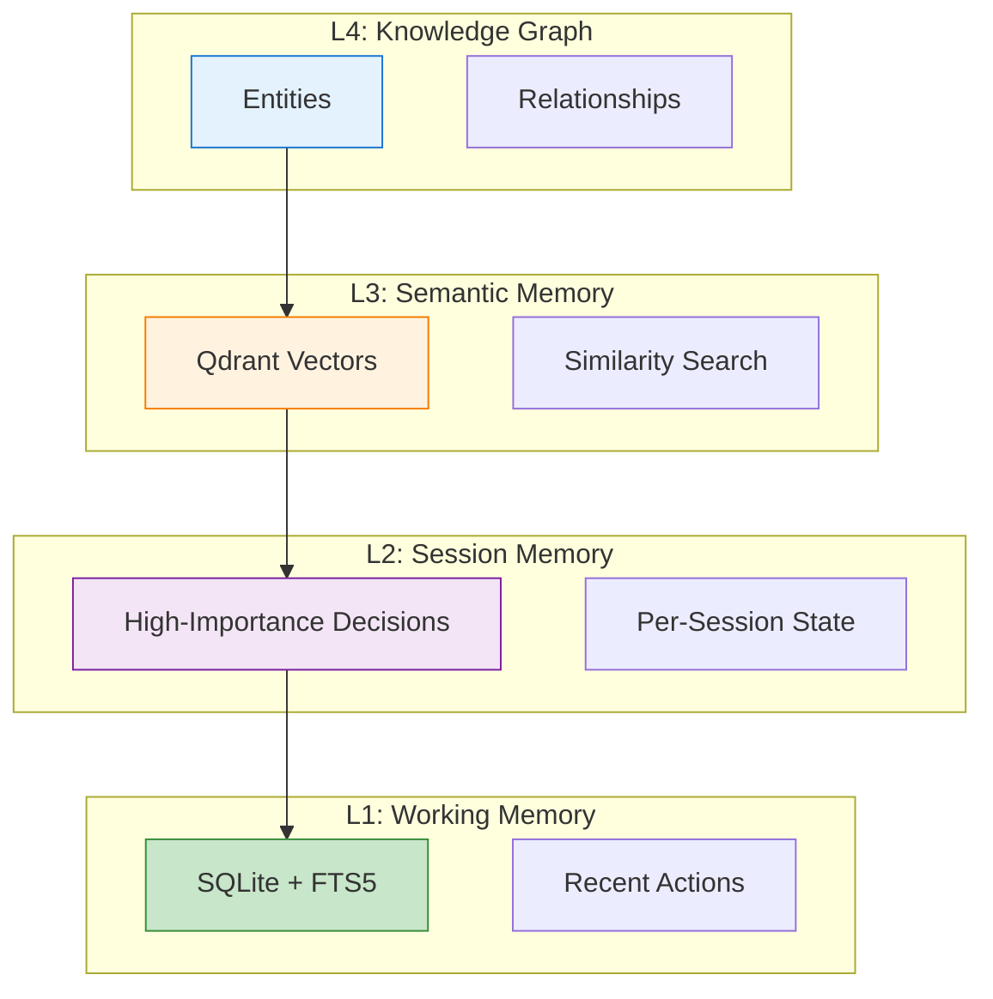
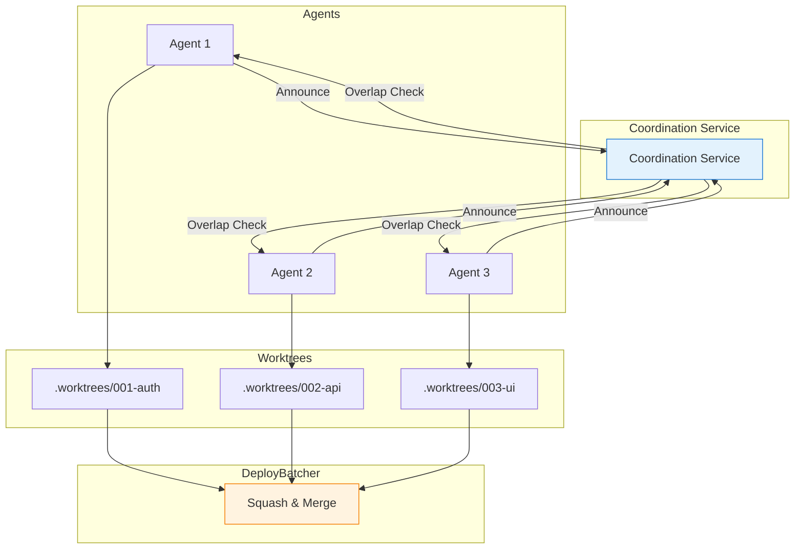
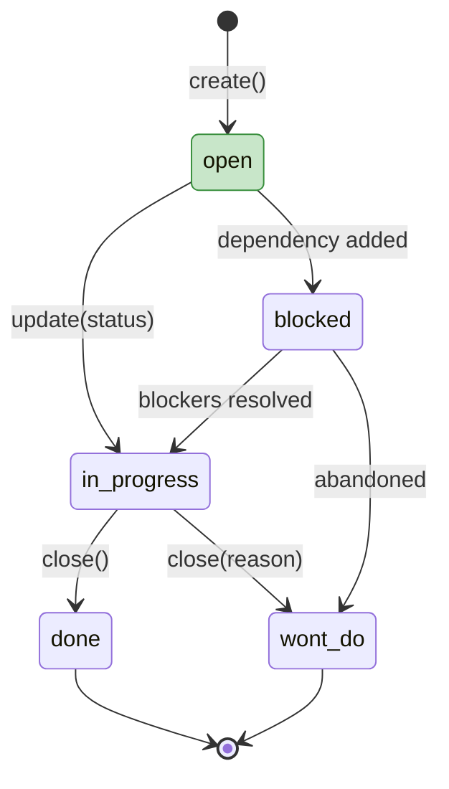
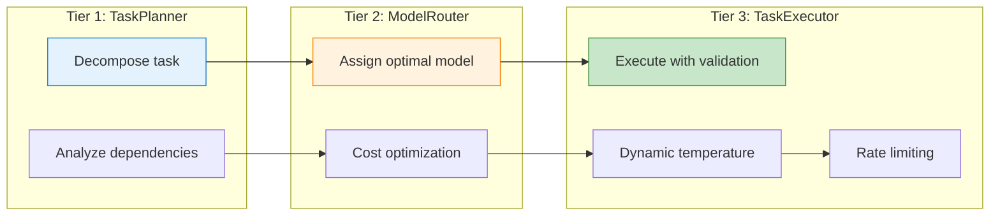

# UAP - Universal Agent Protocol

> **Version:** 1.20.32  
> **Last Updated:** 2026-04-08  
> **License:** MIT License: MIT

---

## Quick Start

```bash
npm install -g @miller-tech/uap
uap init
uap setup -p all
```

---

## Architecture

### Four-Layer Memory System



| Layer         | Storage                   | Capacity   | Latency |
| ------------- | ------------------------- | ---------- | ------- |
| L1: Working   | SQLite `memories`         | 50 entries | <1ms    |
| L2: Session   | SQLite `session_memories` | Unlimited  | <5ms    |
| L3: Semantic  | Qdrant vectors            | Unlimited  | ~50ms   |
| L4: Knowledge | SQLite entities/rels      | Unlimited  | <20ms   |

### Multi-Agent Coordination



---

## Core Features

### Memory System (27 modules)

| Component     | Storage                   | Capacity   | Latency |
| ------------- | ------------------------- | ---------- | ------- |
| L1: Working   | SQLite `memories`         | 50 entries | <1ms    |
| L2: Session   | SQLite `session_memories` | Unlimited  | <5ms    |
| L3: Semantic  | Qdrant vectors            | Unlimited  | ~50ms   |
| L4: Knowledge | SQLite entities/rels      | Unlimited  | <20ms   |

\*\*
tiering (Hot/Warm/Cold) with automatic promotion/demotion

- Semantic compression for token-efficient storage
- Write-gate quality filtering (5 criteria, min score 0.3)
- Correction propagation across memory tiers

### Multi-Agent Coordination (8 modules)

- **Agent Registry**: Track active agents with heartbeat monitoring
- **Work Announcements**: Declare intent before editing resources
- **Overlap Detection**: Prevent conflicts via resource analysis
- **Inter-Agent Messaging**: Broadcast, direct, and channel-based communication
- **Deploy Batching**: Squash, merge, parallelize deploy actions

### Task Management (7 modules)



---

## CLI Reference

### 25 Top-Level Commands

| Command                 | Description                                  |
| ----------------------- | -------------------------------------------- |
| `uap init`              | Initialize UAP in a project                  |
| `uap setup -p all`      | Full setup (memory, Qdrant, hooks, patterns) |
| `uap memory <action>`   | Memory management (9 subcommands)            |
| `uap worktree <action>` | Git worktree management (5 subcommands)      |
| `uap agent <action>`    | Agent lifecycle (10 subcommands)             |
| `uap deploy <action>`   | Deploy batching (8 subcommands)              |
| `uap task <action>`     | Task management (15 subcommands)             |
| `uap policy <action>`   | Policy management (15 subcommands)           |
| `uap model <action>`    | Multi-model management (8 subcommands)       |
| `uap patterns <action>` | Pattern RAG management (4 subcommands)       |

**Total: 109 commands and subcommands.**

### Common Operations

```bash
# Query semantic memory
uap memory query "authentication errors"

# Create tracked task
uap task create --title "Fix login bug" --type bug

# Check for agent overlaps
uap agent overlaps --resource src/auth.ts

# Queue deploy action
uap deploy queue --action commit --target main --message "feat: add auth"

# View dashboard
uap dashboard
```

---

## Pattern System (23 Patterns)

Battle-tested patterns from Terminal-Bench 2.0:

| Pattern               | ID  | Prevents                               |
| --------------------- | --- | -------------------------------------- |
| Output Existence      | P12 | Missing output files (37% of failures) |
| Iterative Refinement  | P13 | First-attempt acceptance               |
| Output Format         | P14 | Wrong format/encoding                  |
| Task-First            | P16 | Over-planning before doing             |
| Constraint Extraction | P17 | Missing hidden requirements            |
| Impossible Refusal    | P19 | Attempting impossible tasks            |
| Chess Engine          | P21 | Reinventing Stockfish                  |
| Git Recovery          | P22 | Data loss during git ops               |
| Compression Check     | P23 | Lossy compression errors               |
| Polyglot              | P24 | Single-language thinking               |
| Near-Miss             | P26 | Almost-correct solutions               |
| Smoke Test            | P28 | Untested changes                       |
| Performance Threshold | P30 | Missing perf targets                   |
| Round-Trip            | P31 | Encode/decode mismatches               |
| CLI Verify            | P32 | Broken CLI commands                    |
| Numerical Stability   | P33 | Floating point errors                  |
| Image Pipeline        | P34 | Image processing errors                |
| Decoder-First         | P35 | Wrong problem decomposition            |
| Competition Domain    | P36 | Missing domain knowledge               |
| Ambiguity Detection   | P37 | Ambiguous task descriptions            |
| IaC Parity            | IaC | Config drift                           |

---

## Multi-Model Architecture

### 3-Tier Execution



---

## MCP Router

Replaces N tool definitions with 2 meta-tools for **98% token reduction**.

### Components (10 modules)

| Component     | Purpose                                     |
| ------------- | ------------------------------------------- |
| MCP Server    | Exposes `discover_tools` and `execute_tool` |
| Config Parser | Loads MCP configs from standard paths       |
| Fuzzy Search  | Tool discovery with fuzzy matching          |
| Client Pool   | Manages connections to MCP servers          |
| Tool Execute  | Tool execution with policy gate             |

---

## Policy Enforcement (8 modules)

### Enforcement Levels

| Level       | Behavior                                        |
| ----------- | ----------------------------------------------- |
| REQUIRED    | Blocks execution, throws `PolicyViolationError` |
| RECOMMENDED | Logged but does not block                       |
| OPTIONAL    | Informational only                              |

### CLI Commands

```bash
uap policy list                    # List all policies
uap policy install <name>          # Install built-in policy
uap policy enable <id>             # Enable a policy
uap policy disable <id>            # Disable a policy
uap policy check -o <operation>    # Check if allowed
uap policy audit                   # View audit trail
```

---

## Browser Automation

Stealth web browser via CloakBrowser (Playwright drop-in):

```typescript
import { createWebBrowser } from '@miller-tech/uap/browser';

const browser = createWebBrowser();
await browser.launch({ headless: true, humanize: true });
await browser.goto('https://example.com');
const content = await browser.getContent();
await browser.close();
```

---

## Testing & Quality

```bash
npm test              # 693 tests across 45 test files
npm run build         # TypeScript compilation
npm run lint          # ESLint
npm run format        # Prettier
npm run test:coverage # Coverage report (50% thresholds)
```

---

## Configuration

### .uap.json (Project Settings)

```json
{
  "version": "1.0.0",
  "project": { "name": "my-project", "defaultBranch": "main" },
  "memory": {
    "shortTerm": { "enabled": true, "path": "./agents/data/memory/short_term.db" },
    "longTerm": { "enabled": true, "provider": "qdrant" }
  },
  "multiModel": {
    "enabled": true,
    "models": ["opus-4.6", "qwen35"],
    "roles": { "planner": "opus-4.6", "executor": "qwen35" },
    "routingStrategy": "balanced"
  },
  "worktrees": { "enabled": true, "directory": ".worktrees" }
}
```

---

## Requirements

| Dependency | Version   | Required | Purpose                    |
| ---------- | --------- | -------- | -------------------------- |
| Node.js    | >= 18.0.0 | Yes      | Runtime                    |
| git        | Latest    | Yes      | Version control, worktrees |
| Docker     | Latest    | No       | Local Qdrant               |
| Python 3   | Latest    | No       | Embeddings, Pattern RAG    |

---

## Performance Impact

| Feature               | Token Savings | Task Completion Impact      |
| --------------------- | ------------- | --------------------------- |
| Memory query (cached) | ~50 tokens    | High (avoids re-learning)   |
| Worktree create       | ~60 tokens    | Very High (safe isolation)  |
| Agent announce        | ~40 tokens    | High (conflict prevention)  |
| Overlap check         | ~30 tokens    | Very High (merge avoidance) |
| Deploy batch          | ~50 tokens    | Very High (CI/CD savings)   |

**Overall Impact:**

- **60-80%** reduction in context repetition
- **50-80%** reduction in CI/CD minutes
- **Near-zero** merge conflicts in multi-agent scenarios

---

## Documentation

- **[Getting Started](docs/getting-started/OVERVIEW.md)**: Core concepts and setup
- **[Architecture](docs/architecture/SYSTEM_ANALYSIS.md)**: Complete system analysis
- **[CLI Reference](docs/reference/UAP_CLI_REFERENCE.md)**: Full command reference
- **[Deployment](docs/deployment/DEPLOYMENT.md)**: Production deployment guide
- **[Benchmarks](docs/benchmarks/README.md)**: Performance analysis

---

## Attribution

- Terminal-Bench patterns from [Terminal-Bench 2.0](https://github.com/aptx432/terminal-bench)
- CloakBrowser from [CloakHQ/CloakBrowser](https://github.com/CloakHQ/CloakBrowser)

---

**[Documentation](docs/INDEX.md)** | **[npm](https://www.npmjs.com/package/@miller-tech/uap)** | **[GitHub](https://github.com/DammianMiller/universal-agent-protocol)**
