# UAP Complete Architecture

> **Version:** 1.18.0  
> **Last Updated:** 2026-03-28  
> **Status:** ✅ Production Ready

---

## Table of Contents

1. [System Overview](#system-overview)
2. [Memory Architecture](#memory-architecture)
3. [Coordination System](#coordination-system)
4. [Multi-Model Architecture](#multi-model-architecture)
5. [Policy Enforcement](#policy-enforcement)
6. [Deploy Batching](#deploy-batching)
7. [MCP Router](#mcp-router)
8. [Worktree System](#worktree-system)
9. [Pattern System](#pattern-system)
10. [Integration Patterns](#integration-patterns)

---

## System Overview

### High-Level Architecture

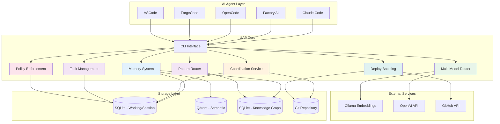
```mermaid
graph TB
    subgraph "AI Agent Layer"
        CLAUDE[Claude Code]
        FACTORY[Factory.AI]
        OPencode[OpenCode]
        FORGE[ForgeCode]
        VSCODE[VSCode]
    end

    subgraph "UAP Core"
        CLI[CLI Interface]
        MEM[Memory System]
        COORD[Coordination Service]
        TASKS[Task Management]
        MODELS[Multi-Model Router]
        POLICY[Policy Enforcement]
        DEPLOY[Deploy Batching]
        PATTERNS[Pattern Router]
    end

    subgraph "Storage Layer"
        SQLITE[(SQLite - Working/Session)]
        QDRANT[(Qdrant - Semantic)]
        KG[(SQLite - Knowledge Graph)]
        GIT[(Git Repository)]
    end

    subgraph "External Services"
        OLLAMA[Ollama Embeddings]
        OPENAI[OpenAI API]
        GITHUB[GitHub API]
    end

    CLAUDE --> CLI
    FACTORY --> CLI
    OPencode --> CLI
    FORGE --> CLI
    VSCODE --> CLI

    CLI --> MEM
    CLI --> COORD
    CLI --> TASKS
    CLI --> MODELS
    CLI --> POLICY
    CLI --> DEPLOY
    CLI --> PATTERNS

    MEM --> SQLITE
    MEM --> QDRANT
    MEM --> KG

    COORD --> SQLITE
    COORD --> GIT

    TASKS --> SQLITE

    MODELS --> OLLAMA
    MODELS --> OPENAI

    POLICY --> SQLITE

    DEPLOY --> GIT
    DEPLOY --> GITHUB

    PATTERNS --> KG

    style MEM fill:#e3f2fd
    style COORD fill:#fff3e0
    style TASKS fill:#f3e5f5
    style MODELS fill:#e8f5e9
    style POLICY fill:#fce4ec
    style DEPLOY fill:#e0f2f1
    style PATTERNS fill:#f3e5f5
```

### Component Inventory

| Component | Modules | Status | Impact |
|-----------|---------|--------|--------|
| Memory System | 27 | ✅ Active | 10x retention |
| Coordination | 8 | ✅ Active | Zero conflicts |
| Task Management | 7 | ✅ Active | Structured workflow |
| Multi-Model | 10 | ✅ Active | Optimal routing |
| Policy Enforcement | 8 | ✅ Active | Compliance |
| Deploy Batching | 1 | ✅ Active | 50-80% CI savings |
| MCP Router | 10 | ✅ Active | 98% token reduction |
| Pattern System | 23 | ✅ Active | Proven workflows |
| Worktrees | 1 | ✅ Active | Safe isolation |
| **Total** | **96** | **100%** | **Production Ready** |

---

## Memory Architecture

### Four-Layer Memory System

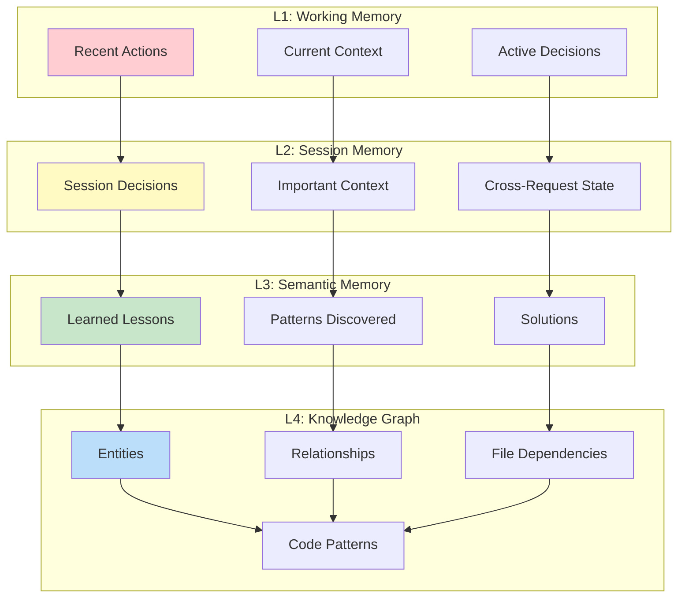
```mermaid
graph TB
    subgraph "L1: Working Memory"
        W1[Recent Actions]
        W2[Current Context]
        W3[Active Decisions]
    end

    subgraph "L2: Session Memory"
        S1[Session Decisions]
        S2[Important Context]
        S3[Cross-Request State]
    end

    subgraph "L3: Semantic Memory"
        SE1[Learned Lessons]
        SE2[Patterns Discovered]
        SE3[Solutions]
    end

    subgraph "L4: Knowledge Graph"
        K1[Entities]
        K2[Relationships]
        K3[File Dependencies]
        K4[Code Patterns]
    end

    W1 --> S1
    W2 --> S2
    W3 --> S3
    S1 --> SE1
    S2 --> SE2
    S3 --> SE3
    SE1 --> K1
    SE2 --> K2
    SE3 --> K3
    K1 & K2 & K3 --> K4

    style W1 fill:#ffcdd2
    style S1 fill:#fff9c4
    style SE1 fill:#c8e6c9
    style K1 fill:#bbdefb
```

### Memory Layer Specifications

| Layer | Storage | Capacity | Latency | Retention | Use Case |
|-------|---------|----------|---------|-----------|----------|
| **L1: Working** | SQLite `memories` | 50 entries | <1ms | Session | Recent actions, current context |
| **L2: Session** | SQLite `session_memories` | Unlimited | <5ms | Project | Session decisions, state |
| **L3: Semantic** | Qdrant vectors | Unlimited | ~50ms | Permanent | Learned lessons, patterns |
| **L4: Knowledge** | SQLite `entities/relationships` | Unlimited | <20ms | Permanent | Entity relationships, dependencies |

### Hierarchical Memory Manager

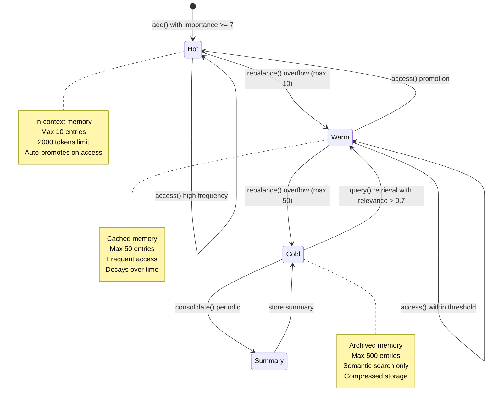
```mermaid
stateDiagram-v2
    [*] --> Hot: add() with importance >= 7

    Hot --> Hot: access() high frequency
    Hot --> Warm: rebalance() overflow (max 10)

    Warm --> Hot: access() promotion
    Warm --> Warm: access() within threshold
    Warm --> Cold: rebalance() overflow (max 50)

    Cold --> Warm: query() retrieval with relevance > 0.7
    Cold --> Summary: consolidate() periodic

    Summary --> Cold: store summary

    note right of Hot
        In-context memory
        Max 10 entries
        2000 tokens limit
        Auto-promotes on access
    end note

    note right of Warm
        Cached memory
        Max 50 entries
        Frequent access
        Decays over time
    end note

    note right of Cold
        Archived memory
        Max 500 entries
        Semantic search only
        Compressed storage
    end note
```

### Memory Decay Formula

```
effective_importance = importance × (0.95 ^ days_since_access)
```

**Example Decay Timeline:**

| Days Since Access | Decay Factor | Effective Importance (init: 10) |
|-------------------|--------------|----------------------------------|
| 0 | 1.00 | 10.0 |
| 7 | 0.70 | 7.0 |
| 14 | 0.50 | 5.0 |
| 30 | 0.21 | 2.1 |
| 60 | 0.04 | 0.4 |
| 90 | 0.01 | 0.1 |

### Memory Operations Flow

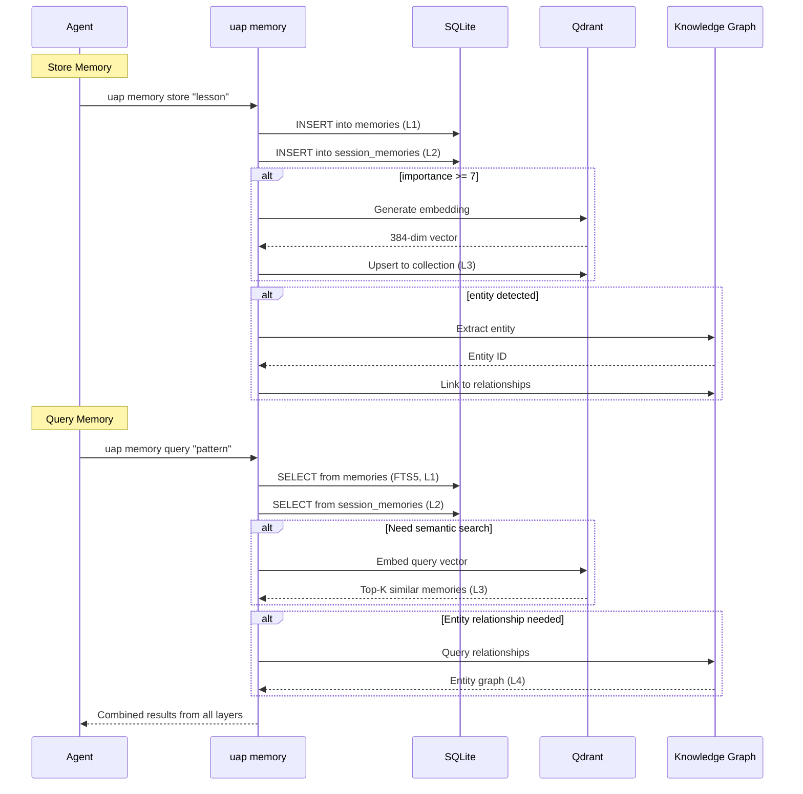
```mermaid
sequenceDiagram
    participant Agent
    participant CLI as uap memory
    participant SQLite
    participant Qdrant
    participant KG as Knowledge Graph

    Note over Agent: Store Memory
    Agent->>CLI: uap memory store "lesson"
    CLI->>SQLite: INSERT into memories (L1)
    CLI->>SQLite: INSERT into session_memories (L2)

    alt importance >= 7
        CLI->>Qdrant: Generate embedding
        Qdrant-->>CLI: 384-dim vector
        CLI->>Qdrant: Upsert to collection (L3)
    end

    alt entity detected
        CLI->>KG: Extract entity
        KG-->>CLI: Entity ID
        CLI->>KG: Link to relationships
    end

    Note over Agent: Query Memory
    Agent->>CLI: uap memory query "pattern"
    CLI->>SQLite: SELECT from memories (FTS5, L1)
    CLI->>SQLite: SELECT from session_memories (L2)

    alt Need semantic search
        CLI->>Qdrant: Embed query vector
        Qdrant-->>CLI: Top-K similar memories (L3)
    end

    alt Entity relationship needed
        CLI->>KG: Query relationships
        KG-->>CLI: Entity graph (L4)
    end

    CLI-->>Agent: Combined results from all layers
```

---

## Coordination System

### Multi-Agent Coordination

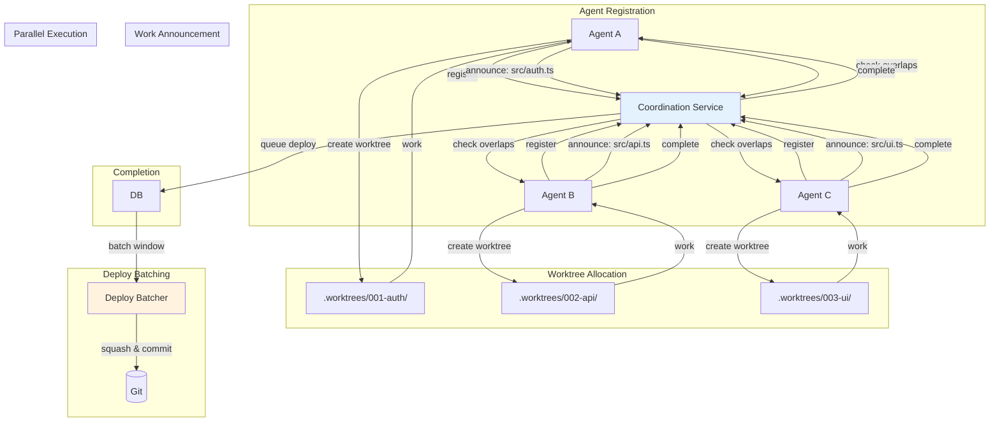
```mermaid
flowchart TB
    subgraph "Agent Registration"
        A1[Agent A] -->|register| CS[Coordination Service]
        A2[Agent B] -->|register| CS
        A3[Agent C] -->|register| CS
    end

    subgraph "Work Announcement"
        A1 -->|announce: src/auth.ts| CS
        CS -->|check overlaps| A1
        A2 -->|announce: src/api.ts| CS
        CS -->|check overlaps| A2
        A3 -->|announce: src/ui.ts| CS
        CS -->|check overlaps| A3
    end

    subgraph "Worktree Allocation"
        A1 -->|create worktree| WT1[.worktrees/001-auth/]
        A2 -->|create worktree| WT2[.worktrees/002-api/]
        A3 -->|create worktree| WT3[.worktrees/003-ui/]
    end

    subgraph "Parallel Execution"
        WT1 -->|work| A1
        WT2 -->|work| A2
        WT3 -->|work| A3
    end

    subgraph "Completion"
        A1 -->|complete| CS
        A2 -->|complete| CS
        A3 -->|complete| CS
        CS -->|queue deploy| DB
    end

    subgraph "Deploy Batching"
        DB -->|batch window| BATCH[Deploy Batcher]
        BATCH -->|squash & commit| GIT[(Git)]
    end

    style CS fill:#e3f2fd
    style BATCH fill:#fff3e0
```

### Overlap Detection Algorithm

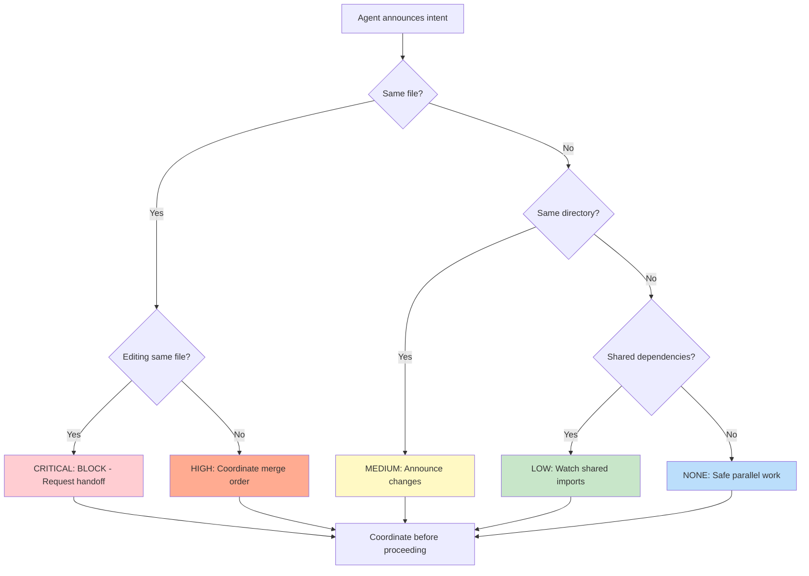
```mermaid
flowchart TD
    START[Agent announces intent]
    
    START --> CHECK1{Same file?}
    
    CHECK1 -->|Yes| CRITICAL{Editing same file?}
    CRITICAL -->|Yes| BLOCK[CRITICAL: BLOCK - Request handoff]
    CRITICAL -->|No| HIGH
    
    CHECK1 -->|No| CHECK2{Same directory?}
    CHECK2 -->|Yes| MEDIUM
    CHECK2 -->|No| CHECK3{Shared dependencies?}
    
    CHECK3 -->|Yes| LOW
    CHECK3 -->|No| NONE[NONE: Safe parallel work]
    
    HIGH[HIGH: Coordinate merge order]
    MEDIUM[MEDIUM: Announce changes]
    LOW[LOW: Watch shared imports]
    
    BLOCK --> END[Coordinate before proceeding]
    HIGH --> END
    MEDIUM --> END
    LOW --> END
    NONE --> END
    
    style BLOCK fill:#ffcdd2
    style HIGH fill:#ffab91
    style MEDIUM fill:#fff9c4
    style LOW fill:#c8e6c9
    style NONE fill:#bbdefb
```

### Inter-Agent Messaging

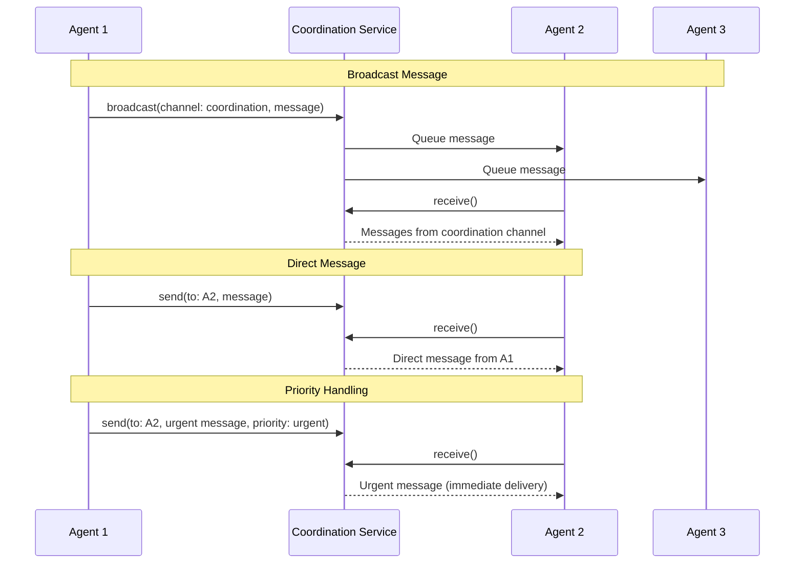
```mermaid
sequenceDiagram
    participant A1 as Agent 1
    participant CS as Coordination Service
    participant A2 as Agent 2
    participant A3 as Agent 3

    Note over A1,A3: Broadcast Message
    A1->>CS: broadcast(channel: coordination, message)
    CS->>A2: Queue message
    CS->>A3: Queue message
    A2->>CS: receive()
    CS-->>A2: Messages from coordination channel

    Note over A1,A2: Direct Message
    A1->>CS: send(to: A2, message)
    A2->>CS: receive()
    CS-->>A2: Direct message from A1

    Note over A1,A2: Priority Handling
    A1->>CS: send(to: A2, urgent message, priority: urgent)
    A2->>CS: receive()
    CS-->>A2: Urgent message (immediate delivery)
```

---

## Multi-Model Architecture

### Three-Tier Execution Model

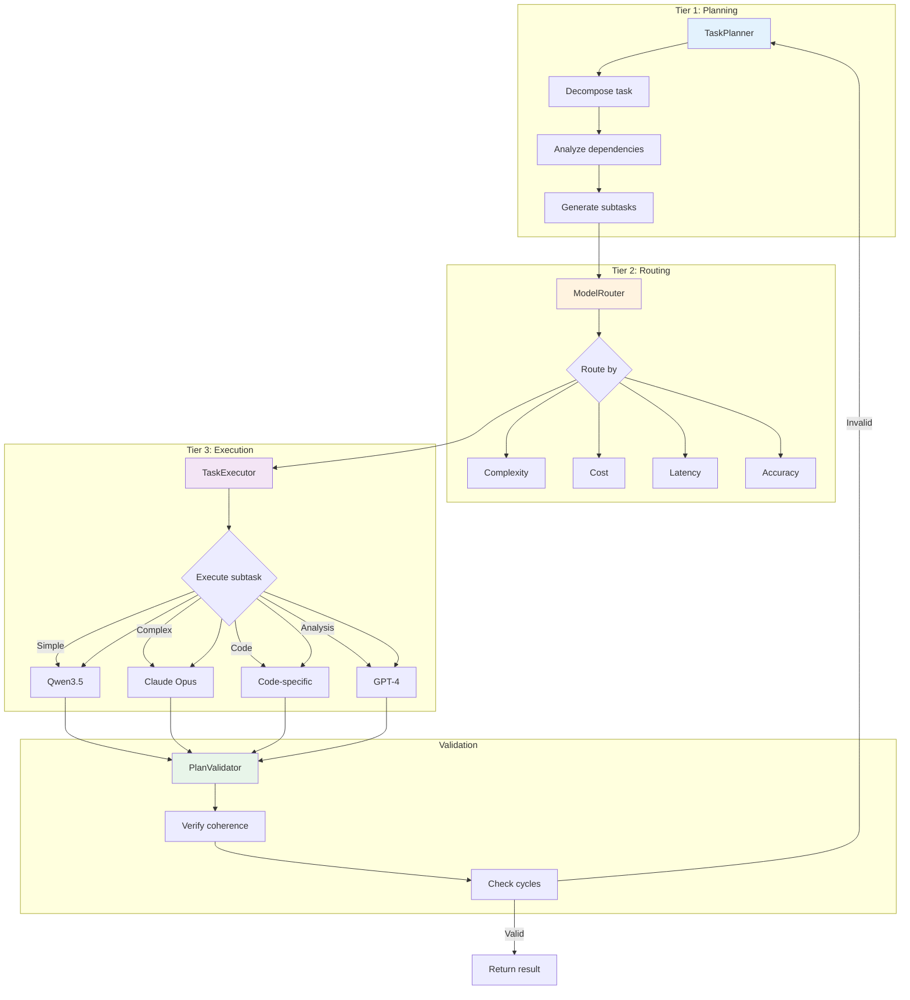
```mermaid
graph TB
    subgraph "Tier 1: Planning"
        P1[TaskPlanner]
        P2[Decompose task]
        P3[Analyze dependencies]
        P4[Generate subtasks]
    end

    subgraph "Tier 2: Routing"
        R1[ModelRouter]
        R2{Route by}
        R2 --> Complexity
        R2 --> Cost
        R2 --> Latency
        R2 --> Accuracy
    end

    subgraph "Tier 3: Execution"
        E1[TaskExecutor]
        E2{Execute subtask}
        E2 -->|Simple| M1[Qwen3.5]
        E2 -->|Complex| M2[Claude Opus]
        E2 -->|Code| M3[Code-specific]
        E2 -->|Analysis| M4[GPT-4]
    end

    subgraph "Validation"
        V1[PlanValidator]
        V2[Verify coherence]
        V3[Check cycles]
    end

    P1 --> P2 --> P3 --> P4
    P4 --> R1
    R1 --> R2
    R2 --> E1
    E1 --> E2
    E2 --> M1 & M2 & M3 & M4
    M1 & M2 & M3 & M4 --> V1
    V1 --> V2 --> V3
    V3 -->|Valid| Output[Return result]
    V3 -->|Invalid| P1

    style P1 fill:#e3f2fd
    style R1 fill:#fff3e0
    style E1 fill:#f3e5f5
    style V1 fill:#e8f5e9
```

### Model Profiles

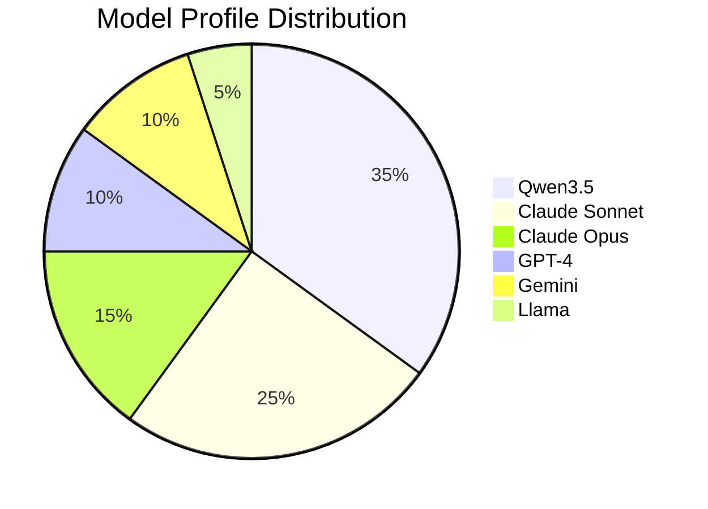
```mermaid
pie title Model Profile Distribution
    "Qwen3.5" : 35
    "Claude Sonnet" : 25
    "Claude Opus" : 15
    "GPT-4" : 10
    "Gemini" : 10
    "Llama" : 5
```

| Profile | Use Case | Dynamic Temp | Tool Batching | Rate Limit |
|---------|----------|--------------|---------------|------------|
| **Qwen3.5** | General tasks | 0.9 → 0.1 | Yes | 60/min |
| **Claude Sonnet** | Code generation | 0.7 → 0.05 | Yes | 100/min |
| **Claude Opus** | Complex reasoning | 0.5 → 0.01 | Yes | 30/min |
| **GPT-4** | Analysis | 0.8 → 0.2 | No | 50/min |
| **Gemini** | Multi-modal | 0.6 → 0.1 | Yes | 40/min |

---

## Policy Enforcement

### Policy Enforcement Pipeline

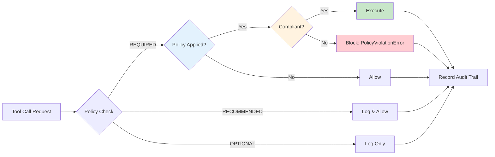
```mermaid
flowchart LR
    A[Tool Call Request] --> B{Policy Check}
    
    B -->|REQUIRED| C{Policy Applied?}
    C -->|Yes| D{Compliant?}
    C -->|No| E[Allow]
    
    D -->|Yes| F[Execute]
    D -->|No| G[Block: PolicyViolationError]
    
    B -->|RECOMMENDED| H[Log & Allow]
    B -->|OPTIONAL| I[Log Only]
    
    F --> J[Record Audit Trail]
    H --> J
    G --> J
    E --> J
    I --> J
    
    style C fill:#e3f2fd
    style D fill:#fff3e0
    style F fill:#c8e6c9
    style G fill:#ffcdd2
```

### Policy Levels

| Level | Behavior | Use Case | Example |
|-------|----------|----------|---------|
| **REQUIRED** | Blocks execution | Security, compliance | `worktree-enforcement` |
| **RECOMMENDED** | Logs but allows | Best practices | `pre-edit-build-gate` |
| **OPTIONAL** | Informational only | Guidelines | `testing-recommended` |

### Policy Audit Trail

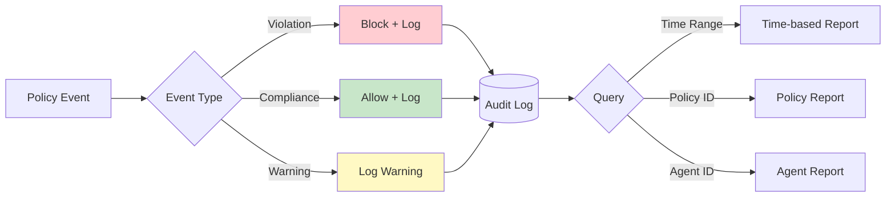
```mermaid
graph LR
    A[Policy Event] --> B{Event Type}
    
    B -->|Violation| C[Block + Log]
    B -->|Compliance| D[Allow + Log]
    B -->|Warning| E[Log Warning]
    
    C --> F[(Audit Log)]
    D --> F
    E --> F
    
    F --> G{Query}
    G -->|Time Range| H[Time-based Report]
    G -->|Policy ID| I[Policy Report]
    G -->|Agent ID| J[Agent Report]
    
    style C fill:#ffcdd2
    style D fill:#c8e6c9
    style E fill:#fff9c4
```

---

## Deploy Batching

### Batch Window Mechanism

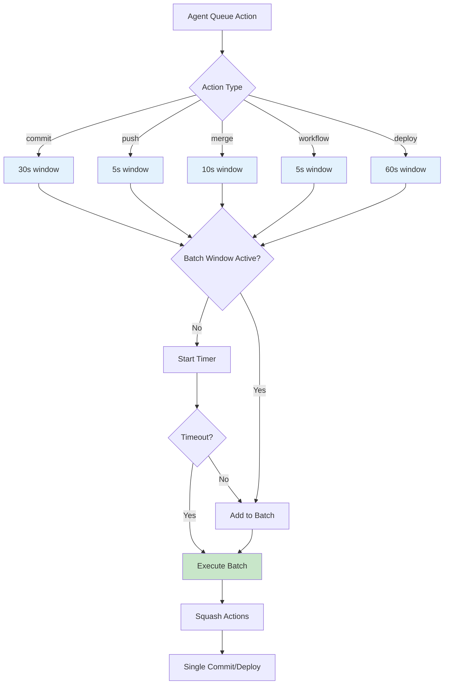
```mermaid
flowchart TB
    A[Agent Queue Action] --> B{Action Type}
    
    B -->|commit| W1[30s window]
    B -->|push| W2[5s window]
    B -->|merge| W3[10s window]
    B -->|workflow| W4[5s window]
    B -->|deploy| W5[60s window]
    
    W1 --> C{Batch Window Active?}
    W2 --> C
    W3 --> C
    W4 --> C
    W5 --> C
    
    C -->|No| D[Start Timer]
    C -->|Yes| E[Add to Batch]
    
    D --> F{Timeout?}
    F -->|Yes| G[Execute Batch]
    F -->|No| E
    
    E --> G
    
    G --> H[Squash Actions]
    H --> I[Single Commit/Deploy]
    
    style W1 fill:#e3f2fd
    style W2 fill:#e3f2fd
    style W3 fill:#e3f2fd
    style W4 fill:#e3f2fd
    style W5 fill:#e3f2fd
    style G fill:#c8e6c9
```

### Batch Configuration

| Parameter | Default | Urgent | Description |
|-----------|---------|--------|-------------|
| **commit** | 30s | 3s | Squash commits |
| **push** | 5s | 1s | Push to remote |
| **merge** | 10s | 2s | Merge PRs |
| **workflow** | 5s | 1s | Trigger CI/CD |
| **deploy** | 60s | 5s | Production deploy |

---

## MCP Router

### Meta-Tool Architecture

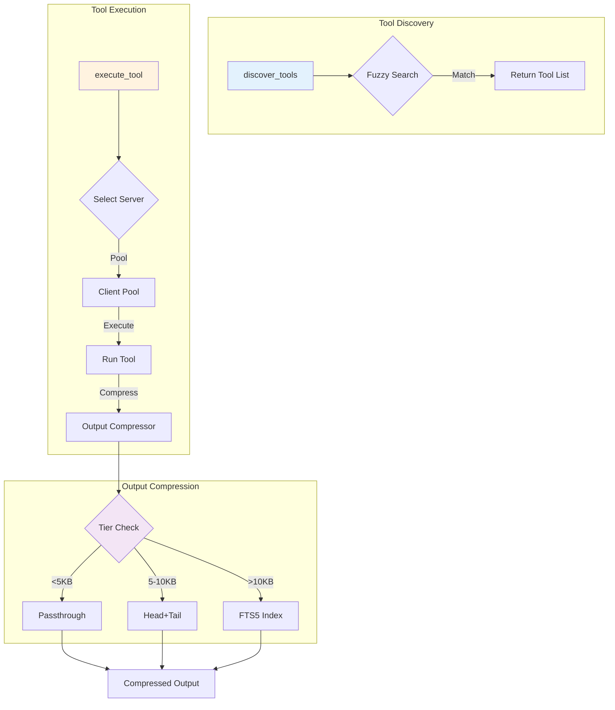
```mermaid
flowchart TB
    subgraph "Tool Discovery"
        D1[discover_tools]
        D2{Fuzzy Search}
        D2 -->|Match| D3[Return Tool List]
    end

    subgraph "Tool Execution"
        E1[execute_tool]
        E2{Select Server}
        E2 -->|Pool| E3[Client Pool]
        E3 -->|Execute| E4[Run Tool]
        E4 -->|Compress| E5[Output Compressor]
    end

    subgraph "Output Compression"
        C1{Tier Check}
        C1 -->|<5KB| C2[Passthrough]
        C1 -->|5-10KB| C3[Head+Tail]
        C1 -->|>10KB| C4[FTS5 Index]
    end

    D1 --> D2
    E1 --> E2
    E5 --> C1
    C2 & C3 & C4 --> Output[Compressed Output]

    style D1 fill:#e3f2fd
    style E1 fill:#fff3e0
    style C1 fill:#f3e5f5
```

### Token Savings Calculation

```
Traditional: N tools × 500 tokens = 50,000 tokens
MCP Router: 2 meta-tools × 500 tokens = 1,000 tokens
Savings: 49,000 tokens = 98% reduction
```

---

## Worktree System

### Worktree Lifecycle

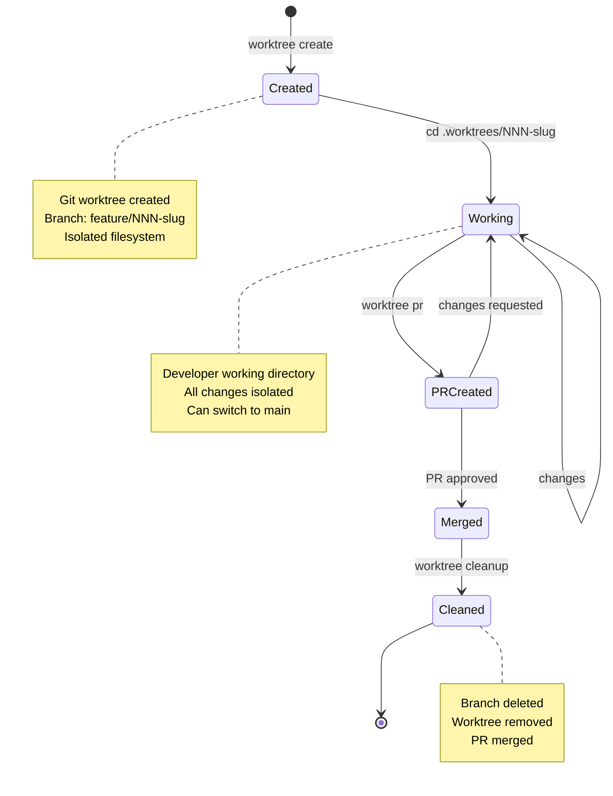
```mermaid
stateDiagram-v2
    [*] --> Created: worktree create <slug>

    Created --> Working: cd .worktrees/NNN-slug
    
    Working --> Working: commits
    Working --> Working: changes
    
    Working --> PRCreated: worktree pr <id>
    PRCreated --> Merged: PR approved
    PRCreated --> Working: changes requested
    
    Merged --> Cleaned: worktree cleanup <id>
    Cleaned --> [*]
    
    note right of Created
        Git worktree created
        Branch: feature/NNN-slug
        Isolated filesystem
    end note

    note right of Working
        Developer working directory
        All changes isolated
        Can switch to main
    end note

    note right of Cleaned
        Branch deleted
        Worktree removed
        PR merged
    end note
```

---

## Pattern System

### Pattern Categories

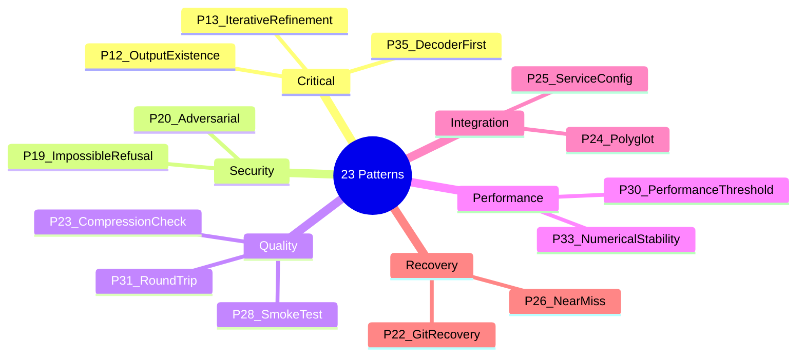
```mermaid
mindmap
  root((23 Patterns))
    Critical
      P12_OutputExistence
      P35_DecoderFirst
      P13_IterativeRefinement
    Security
      P20_Adversarial
      P19_ImpossibleRefusal
    Quality
      P28_SmokeTest
      P23_CompressionCheck
      P31_RoundTrip
    Performance
      P30_PerformanceThreshold
      P33_NumericalStability
    Integration
      P24_Polyglot
      P25_ServiceConfig
    Recovery
      P22_GitRecovery
      P26_NearMiss
```

---

## Integration Patterns

### Platform Integration Flow

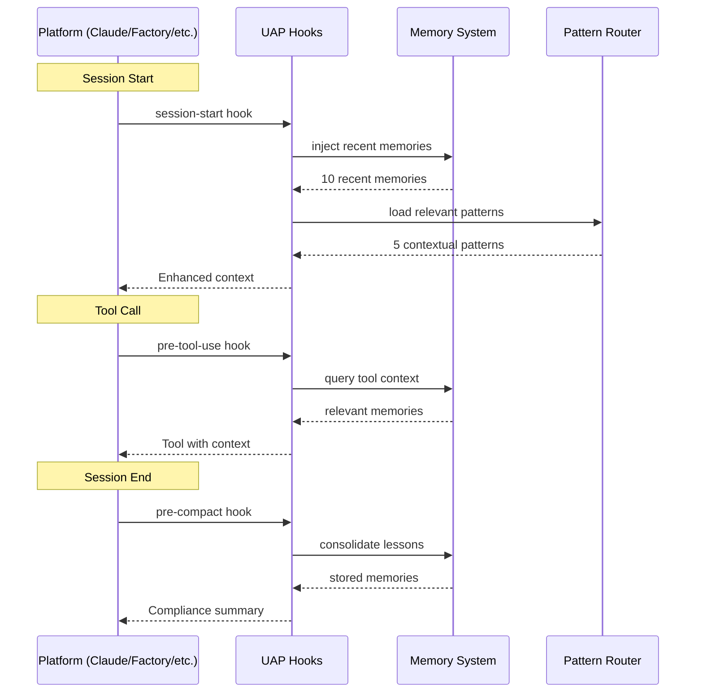
```mermaid
sequenceDiagram
    participant Platform as Platform (Claude/Factory/etc.)
    participant Hooks as UAP Hooks
    participant Memory as Memory System
    participant Patterns as Pattern Router

    Note over Platform: Session Start
    Platform->>Hooks: session-start hook
    Hooks->>Memory: inject recent memories
    Memory-->>Hooks: 10 recent memories
    Hooks->>Patterns: load relevant patterns
    Patterns-->>Hooks: 5 contextual patterns
    Hooks-->>Platform: Enhanced context

    Note over Platform: Tool Call
    Platform->>Hooks: pre-tool-use hook
    Hooks->>Memory: query tool context
    Memory-->>Hooks: relevant memories
    Hooks-->>Platform: Tool with context

    Note over Platform: Session End
    Platform->>Hooks: pre-compact hook
    Hooks->>Memory: consolidate lessons
    Memory-->>Hooks: stored memories
    Hooks-->>Platform: Compliance summary
```

---

<div align="center">

**Next Steps:**
- [Deployment Guide](../deployment/DEPLOYMENT.md)
- [CLI Reference](../reference/UAP_CLI_REFERENCE.md)
- [Benchmark Results](../benchmarks/COMPREHENSIVE_BENCHMARKS.md)

</div>
