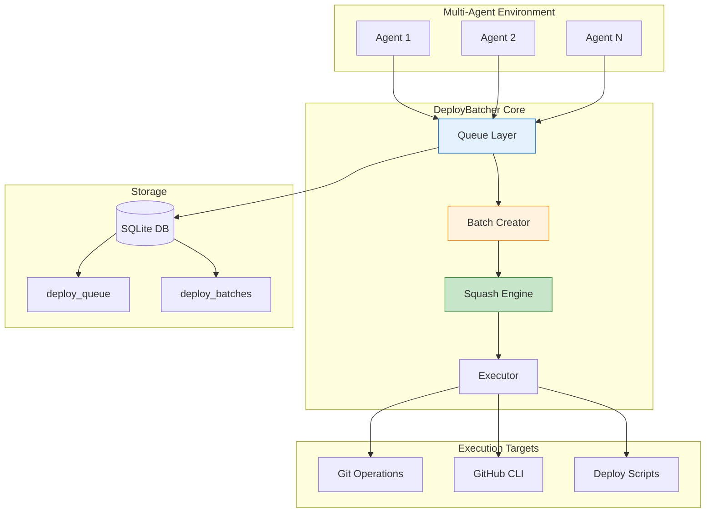
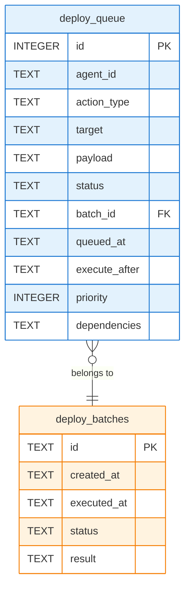

# DeployBatcher Analysis

Intelligent batching and deduplication for multi-agent deployment scenarios.

---

## Overview

The `DeployBatcher` optimizes CI/CD pipeline usage in multi-agent environments through SQLite-backed coordination. Multiple agents queue actions that batch into single CI runs, reducing pipeline minutes by 50-80%.

### Problem Solved

```text
Without DeployBatcher:
  Agent A commits → CI Run 1 (5 min)
  Agent B commits → CI Run 2 (5 min)  
  Agent C commits → CI Run 3 (5 min)
  Agent A pushes → CI Run 4 (5 min)
  Total: 4 runs × 5 min = 20 CI minutes

With DeployBatcher:
  Agent A, B, C queue commits → Batched → Single squashed commit
  Total: 1 run × 5 min = 5 CI minutes (75% reduction)
```

---

## Architecture



---

## Usage Examples

### Example 1: Multi-Agent Commit Batching

```typescript
import { DeployBatcher } from './coordination/deploy-batcher.js';

const batcher = new DeployBatcher({ message: 'feat: add user auth',
  files: ['src/auth.ts', 'src/user.ts']
});

// Agent 2 commits (within window - will be merged)
await batcher.queue('agent-2', 'commit', 'main', {
  message: 'feat: add logging',
  files: ['src/logger.ts']
});

// After 30s, create and execute batch
const batch = await batcher.createBatch();
const result = await batcher.executeBatch(batch.id);

console.log(result);
// {
//   batchId: 'uuid',
//   success: true,
//   executedActions: 1,  // Squashed into single commit
//   failedActions: 0,
//   duration: 1234
// }
```

### Example 2: Urgent Deployment

```typescript
const batcher = new DeployBatcher();

// Enable urgent mode for critical fix
batcher.setUrgentMode(true);

// Queue with minimal delay
await batcher.queue('agent-1', 'commit', 'main', {
  message: 'hotfix: critical security patch',
  files: ['src/security.ts']
}, { urgent: true });

await batcher.queue('agent-1', 'push', 'main', {}, { urgent: true });

// Immediately flush
const results = await batcher.flushAll();

// Restore normal mode
batcher.setUrgentMode(false);
```

### Example 3: Bulk Queue with Transaction

```typescript
import { DeployBatcher } from './coordination/deploy-batcher.js';

const batcher = new DeployBatcher();

console.log(`Queued ${ids.length} actions`);
```

---

## Performance Characteristics

### Time Complexity

| Operation | Complexity | Notes |
|-----------|------------|-------|
| `queue()` | O(1) | Single INSERT |
| `queueBulk()` | O(n) | Transaction with n INSERTs |
| `createBatch()` | O(n log n) | SELECT + grouping + squashing |
| `executeBatch()` | O(n) sequential, O(n/p) parallel | p = maxParallelActions |
| `flushAll()` | O(b × n) | b batches, n actions each |

### Space Complexity

| Storage | Size |
|---------|------|
| Per action | ~500 bytes (JSON payload) |
| Per batch | ~100 bytes + action references |
| SQLite overhead | ~4KB per page |

### Recommended Limits

| Parameter | Default | Max Recommended |
|-----------|---------|-----------------|
| `maxBatchSize` | 20 | 100 |
| `maxParallelActions` | 5 | 10 |
| Queue depth | - | 1000 actions |

---

## Database Schema



---

## Summary

The `DeployBatcher` provides a comprehensive solution for optimizing CI/CD pipeline usage in multi-agent environments:

| Feature | Benefit |
|---------|---------|
| Dynamic batch windows | Balances speed vs batching per action type |
| Commit squashing | Reduces N commits to 1 CI run |
| Action merging | Deduplicates redundant operations |
| Parallel execution | Faster batch completion |
| Urgent mode | Fast path for critical operations |
| SQLite persistence | Survives agent restarts |
| CLI integration | Easy manual control |

**Typical CI/CD savings**: 50-80% reduction in pipeline minutes for multi-agent workflows.
