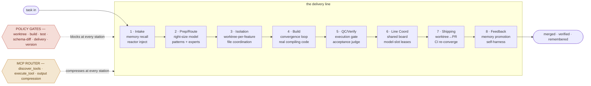
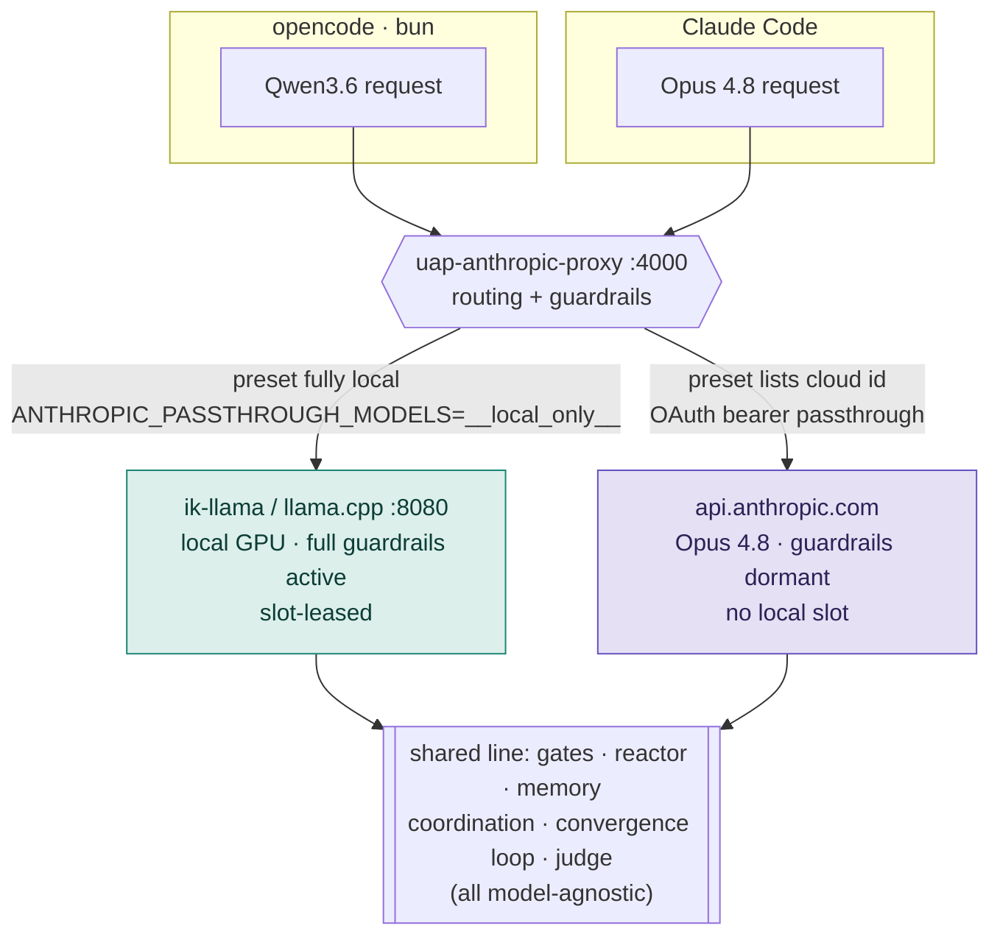
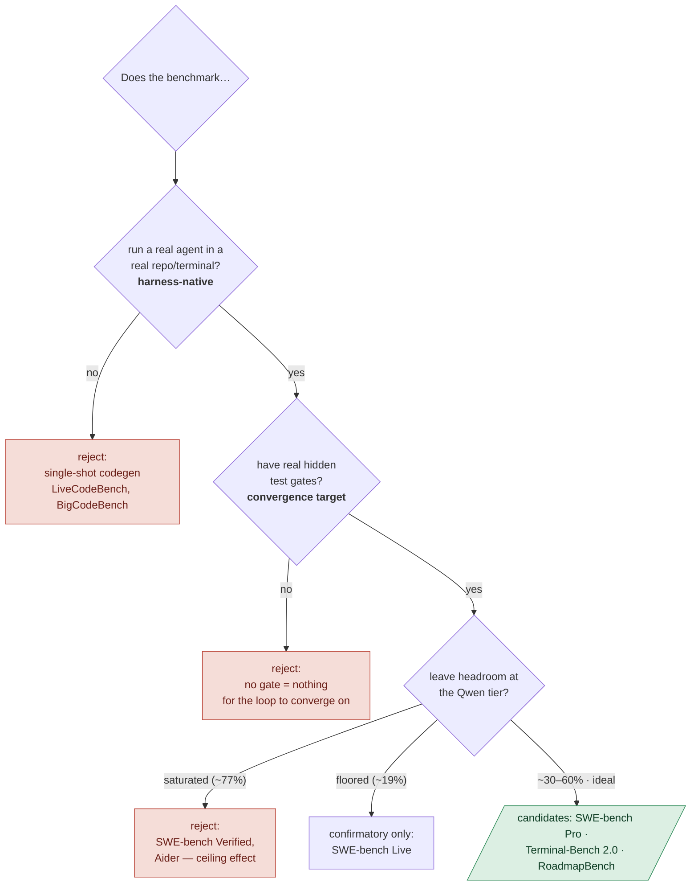

# UAP Across Two Agents — and How to Measure the Uplift

**One delivery line, two very different coding agents: `opencode` + Qwen3.6 (local) and Claude Code + Opus 4.8 (cloud). Then: the benchmark that can actually prove UAP moved the needle.**

UAP is a *harness layer*, not a model. It bolts the [8-station delivery pipeline](DELIVERY_PIPELINE.md), a set of blocking [policy gates](POLICIES.md), and an [inference proxy](LOCAL_MODELS.md) around **whatever** coding agent you already use — turning a talented-but-unreliable agent into one that ships gated, verified, convergent code. This guide traces that process end-to-end, applies it seam-by-seam to two host agents at opposite ends of the capability spectrum, and lands on how to benchmark the difference.

> **Companion artifact:** the visual version of this doc (schematic diagrams, routing lanes, benchmark matrix) is the published UAP process reference. This doc is the checked-in, code-cited source of truth.

---

## 1. The end-to-end process

A task enters at **Intake** and leaves as **merged, verified, remembered** work. Two things run the entire length of the line — **policy gates** (executable, blocking) and the **MCP router** (context compression). Everything below is code; the narrative anchor is [`DELIVERY_PIPELINE.md`](DELIVERY_PIPELINE.md).



| # | Station | Purpose | Implemented in |
|---|---------|---------|----------------|
| 1 | **Intake** | Onboard the agent: memory recall, reactor capability injection, DESIGN.md | `src/memory/` · `src/coordination/reactor.ts` |
| 2 | **Prep / Route** | Right-size the model; pull matching patterns + expert droids | `src/models/router.ts` · `src/coordination/pattern-router.ts` |
| 3 | **Isolation** | Worktree-per-feature, live file coordination, deliver-not-raw-edit | `src/cli/worktree.ts` · `src/policies/enforcers/worktree_required.py` |
| 4 | **Build** | Convergence loop drives the model to real, compiling code — not stubs | `src/delivery/convergence-loop.ts` · `applier.ts` |
| 5 | **QC / Verify** | Run the code (headless / vm-dom / child-proc) + independent acceptance judge | `src/delivery/execution-gate.ts` · `acceptance-judge.ts` |
| 6 | **Line Coord** | Shared board, model-slot leases, deploy batching | `src/coordination/service.ts` · `src/utils/model-slot-lease.ts` |
| 7 | **Shipping** | Worktree → PR, version gate, CI-feedback re-converge on red, never force-push | `src/delivery/ci-watcher.ts` · `src/cli/worktree.ts` |
| 8 | **Feedback** | Promote learnings to long-term memory, reinforce patterns, self-harness | `src/memory/memory-consolidator.ts` · `src/self-harness/` |

---

## 2. The two rails that enforce the line

The stations are where work happens; the rails are why it can't cheat.

### Gates — three enforcement surfaces
- **PreToolUse enforcers** (Python, *blocking*): `worktree_required`, `pre-edit-build-gate`, `test_gate`, `delivery_enforcement`, `schema_diff_gate`, `expert_review_required` — in `src/policies/enforcers/*.py`.
- **In-loop CLI gates** (inside `uap deliver`): the tiered verifier ladder `fast → integration → deploy-dev` (`src/delivery/verifier-ladder.ts`), the execution/runtime gate (`execution-gate.ts`), and the acceptance judge — **generator ≠ evaluator** (`acceptance-judge.ts`).
- **CI feedback watcher** (`src/delivery/ci-watcher.ts`): commits, matches the CI run by head SHA, re-converges on red — never force-pushes, never touches `main`.

### The inference proxy — `anthropic_proxy.py` (`:4000`)
An Anthropic-Messages-API-compatible reverse proxy in front of the local ik-llama/Qwen server (`:8080`); it can also passthrough to real Anthropic via a Max-plan OAuth bearer. Its guardrails keep a cheap local model productive:

| Guardrail | Breaks / fixes |
|-----------|----------------|
| `STUCK-BREAK` | Model self-reports "stuck" but repeats the same failing tool → releases it to a prose exit |
| `DEFERRAL-BREAK` | No-tool prose turn that defers work ("I need more exploration cycles") → fires to keep the build alive |
| cycle-break / auto-ban | Per-tool cycle detection narrows, then session-bans a cycling tool (escape hatches exempt) |
| `RECON-convergence` | After N read-only turns, forces synthesis / `deliver`; hard tier flips the phase |
| required-tool re-roll | Required-tool turns that emit no tool call are re-rolled |
| path-normalize | Rewrites tool-call file paths into the workdir before returning |
| session-admission | Decides which model IDs are served locally vs passed through |

Serving-layer recipes (Fusion / Confidence, generator ≠ judge) live in `tools/agents/scripts/confidence_escalation.py`.

---

## 3. Feature application to two agents

UAP attaches to a host agent through **five seams**. The routing preset decides whether a request is served by the local Qwen or passed through to cloud Opus — **the proxy is the same binary in both cases.**



### The five integration seams

| Seam | Mechanism | opencode + Qwen3.6 | Claude Code + Opus 4.8 |
|------|-----------|--------------------|------------------------|
| **a · Proxy** (`anthropic_proxy.py`) | Model baseURL → `:4000`; guardrails + routing applied transparently | ✅ serves Qwen **locally + full guardrails** | ◑ **passthrough** to Anthropic (OAuth) |
| **b · Hooks** (session-start / Stop / PreToolUse) | Memory inject, policy gates, file coord, schema-diff | ✅ `.opencode/hooks/*.sh` | ✅ `.claude/` hooks |
| **c · Reactor** (per-prompt capability inject) | Auto-applies experts / skills / patterns into the system prompt each turn | ✅ plugin `.opencode/plugin/uap-reactor.ts` | ✅ via hooks |
| **d · Policy files** | Standing instructions; enforcers are the executable backstop | ✅ `AGENT.md` / `AGENTS.md` | ✅ `CLAUDE.md` |
| **e · MCP router** (`uap-router`, 4 meta-tools) | `discover_tools` · `execute_tool` · `deliver` · `react` | ✅ `opencode.json` | ✅ `.mcp.json` |

**The asymmetry is the point.** Qwen leans on seam **(a)** — the proxy's guardrails are what make an unreliable local model *usable inside a gated line at all*. Opus barely touches them; for Opus the value is **governance** (gates, memory, coordination), not babysitting. A third host, **Codex**, is MCP-first: it lacks per-prompt hooks and calls `react`/`deliver` itself through seam **(e)**.

---

## 4. Measuring the uplift — the right benchmark

The thing we want to measure is a **harness delta**, model held fixed:

```
uplift = score(Qwen3.6 + UAP) − score(Qwen3.6 + plain agent)
```

The benchmark is a fixed instrument; the harness is the independent variable. So the instrument must expose that delta. Four criteria follow — plus one lesson from UAP's own prior runs.



### The trap already hit
Prior UAP paired runs showed **zero uplift on toy suites** — baseline scored ~100%, so there was nothing to add (ceiling effect). `uap deliver` couldn't beat baseline on structurally-easy terminal tasks; the real value showed up only on **real-gate projects**. So: **avoid SWE-bench Verified & Aider** (Qwen already saturating) and avoid pure-binary floors like SWE-bench Live where uplift also vanishes.

### Ranked recommendation

| Tier | Benchmark | Why | Headroom (Qwen tier)† |
|------|-----------|-----|------------------------|
| **Primary** | **SWE-bench Pro** (public split) | Hidden `FAIL_TO_PASS` / `PASS_TO_PASS` suites = the truest analog to UAP's converge-to-green gate; multi-file real repos; contamination-resistant vs Verified; mature swappable scaffolds; public Scale leaderboard | ~53% · ideal |
| **Secondary** | **Terminal-Bench 2.0** (report Hard subset separately) | The canonical *harness-native* bench with a neutral baseline scaffold; **already publishes a same-model / different-harness delta (~5 pts)** — public prior art that this instrument measures exactly what UAP adds; broadens the claim beyond Python | ~59% · good |
| **Stretch** | **RoadmapBench** | Per-subtask **partial-credit** scoring — the most sensitive detector of a convergence loop's *incremental* gains (2→4 of 5 subtasks green registers a delta); largest headroom | ~39% top · huge |

**Why not AEON-Bench** (the "aeon" candidate): it's a real, llama.cpp-native, signed-attestation benchmarking *platform* — but it evaluates *its own* three harnesses, not a drop-in like UAP, so it can't cleanly A/B your harness. Use it downstream as a credible signed public venue to report the Qwen3.6 + UAP stack — not as the measurement.

† *Figures are directional (mid-2026 aggregators). Re-pull exact Qwen3.6 numbers from the primary leaderboards ([tbench.ai](https://www.tbench.ai), [labs.scale.com](https://labs.scale.com/leaderboard/swe_bench_pro_public), the RoadmapBench repo) before publishing. The selection logic, not the digits, is load-bearing.*

### Measurement guardrails
1. **Hold all but the harness constant** — same weights, quant, decode params, context, tool budget, task set, seeds. Only diff: plain-agent vs UAP.
2. **Multi-seed + paired stats** (≥5 seeds; paired bootstrap / McNemar per instance). A single-run delta is noise. `uap bench paired` already does this.
3. **Standardize the baseline agent** — `mini-SWE-agent` (bash-only, no structured tool-calls) is the most robust control for Qwen via llama.cpp and avoids tool-call garbling that would unfairly punish the baseline.
4. **Report the split + scaffold every time** — SWE-bench Pro has conflicting "best" numbers across splits and scaffolds.
5. **Budget for adapters and cost** — wrapping UAP into Harbor (Terminal-Bench) and the SWE-bench Pro runner is real engineering; Terminal-Bench (89 tasks) is cheapest, RoadmapBench is heavy.

### Runnable A/B
The `uap bench paired` harness config that wires the SWE-bench Pro A/B against Qwen3.6 — generator, arm definitions, and the exact invocation — lives at **[`benchmarks/suites/swe-bench-pro/`](../../benchmarks/suites/swe-bench-pro/README.md)**.

---

## See also
- [The UAP Delivery Pipeline](DELIVERY_PIPELINE.md) — the full station-by-station tour
- [`uap deliver`](DELIVER.md) — the Build + QC convergence harness
- [Local Models](LOCAL_MODELS.md) · [Qwen3.6 on llama.cpp](QWEN36_LLAMACPP.md) — the proxy + local serving
- [Reactor (auto-apply)](../design/UAP_REACTOR.md) — per-prompt capability injection (seam c)
- [Platforms](../reference/PLATFORMS.md) — the 9 supported harnesses
